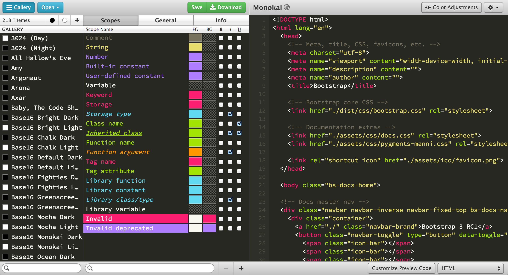
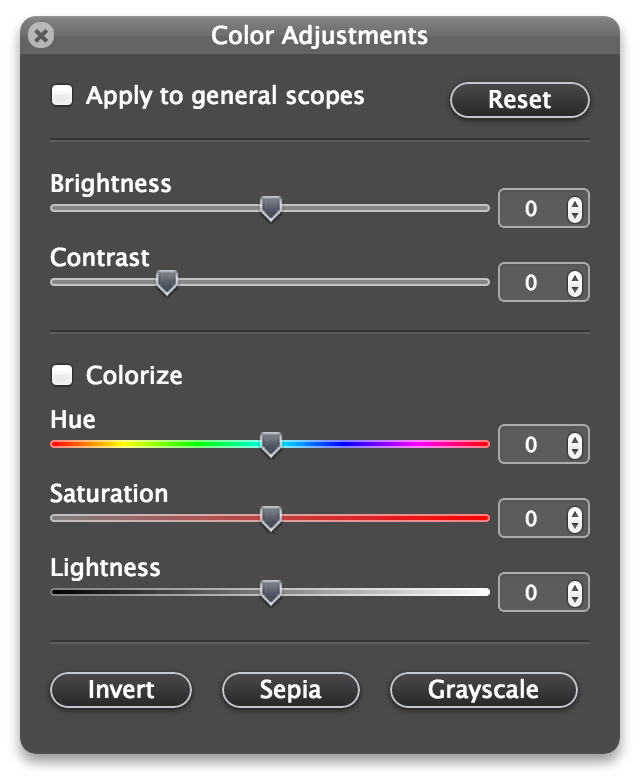
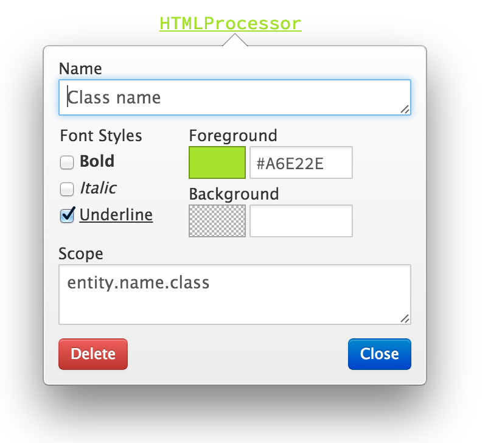

# [TMTheme Editor](http://tmtheme-editor.herokuapp.com/)

**TMTheme Editor** is a color scheme editor for [SublimeText](http://www.sublimetext.com/), 
[Textmate](http://macromates.com/) and bunch of other text editors.
It allows you to edit `tmtheme` files easier and faster. it's written in [coffeescript](http://coffeescript.org/) 
using [angular.js](angularjs.org)

### [tmtheme-editor.herokuapp.com](http://tmtheme-editor.herokuapp.com/)

## Copyright
**tmThemeEditor**  
&copy; Copyright 2012-2014 Allen Bargi

This program is free software: you can redistribute it and/or modify
it under the terms of the GNU Affero General Public License as
published by the Free Software Foundation, either version 3 of the
License, or (at your option) any later version.

This program is distributed in the hope that it will be useful,
but WITHOUT ANY WARRANTY; without even the implied warranty of
MERCHANTABILITY or FITNESS FOR A PARTICULAR PURPOSE.  See the
GNU Affero General Public License for more details.

You should have received a copy of the GNU Affero General Public License
along with this program.  If not, see <http://www.gnu.org/licenses/>.
